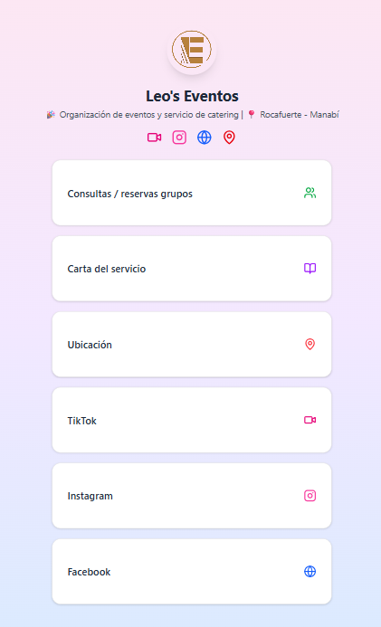

# Leo Eventos 🎉

**Leo Eventos** es una página web de presentación para un servicio de catering y organización de eventos. Es uno de mis primeros proyectos desarrollados con tecnologías modernas del ecosistema frontend. Representa un espacio para mostrar mis habilidades en diseño web y desarrollo con React y TypeScript.

## 🚀 Tecnologías utilizadas

- ⚛️ [React](https://react.dev/)
- 🟦 [TypeScript](https://www.typescriptlang.org/)
- 🎨 [Tailwind CSS](https://tailwindcss.com/)
- 🧩 [Shadcn UI](https://ui.shadcn.com/)

## 🌐 Funcionalidades principales

- Página responsive (adaptada a dispositivos móviles y escritorio)
- Interfaz moderna y profesional
- Enlace directo a contacto por WhatsApp
- Estética pastel personalizada
- Componentes reutilizables con Shadcn

## 📷 Captura de pantalla

## 🔗 Enlace al sitio web

[👉 Visita Leo Eventos aquí](https://tuusuario.github.io/nombre-del-repositorio)

## 📱 Contacto

¿Te interesa saber más o necesitas una página web como esta?  
Escríbeme por WhatsApp: [https://wa.me/593963312049](https://wa.me/593963312049)

---

> 🎓 Este proyecto fue creado como parte de mi proceso de aprendizaje en desarrollo frontend.  
> ¡Agradezco cualquier sugerencia para seguir mejorando!
